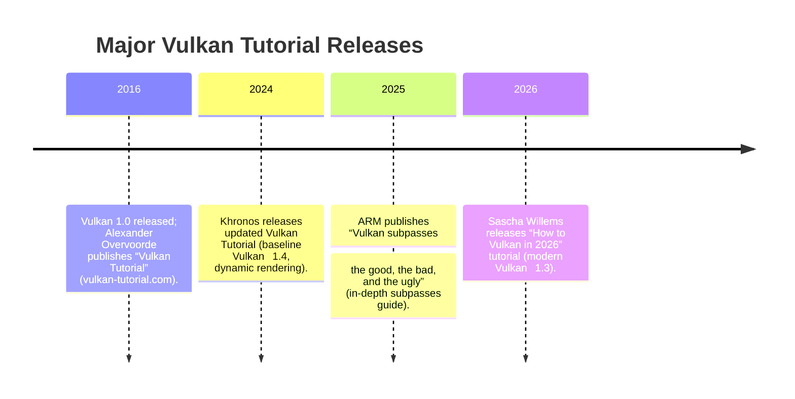

# Vulkan 1.0 Resources (Modern and Render-Pass Focus)

**Executive Summary:** We surveyed official and community Vulkan resources to identify (A) *modern* Vulkan tutorials (up-to-date, using current best practices and libraries) and (B) *render-pass*–focused guides (deep coverage of render passes/subpasses). Key finds include Sascha Willems’s “How to Vulkan in 2026” tutorial (modern, Vulkan 1.3 baseline), Khronos’s official Vulkan Tutorial (up-to-date C++ tutorial), and major sample repos (SaschaWillems/Vulkan, KhronosGroup/Vulkan-Samples, NVIDIA nvpro-samples). For render-pass detail, Samsung’s “Introduction to Vulkan Render Passes” and ARM’s “Vulkan subpasses: the good, bad, and ugly” give deep conceptual and practical insight. We rate each resource’s relevance and beginner-friendliness and summarize content, code examples, and Vulkan 1.0 compatibility notes. 



## A. Modern/New Vulkan Tutorials (Best Practices and Libraries)

### How to Vulkan in 2026  
- **Author:** Sascha Willems (blog/repo)  
- **URL:** [howtovulkan.com](https://www.howtovulkan.com) (text) / [GitHub](https://github.com/SaschaWillems/HowToVulkan) (code)  
- **Last Updated:** July 16, 2026  
- **Summary:** A *single-page* C++ tutorial that walks through setting up a Vulkan rasterization app using a modern feature set. It is explicitly aimed at today’s best practices: using Vulkan 1.3 features like dynamic rendering (the tutorial uses dynamic rendering instead of legacy render passes), Descriptor Indexing, buffer device address, and newer synchronization (e.g. timeline semaphores). The entire tutorial (and single-file code) can be worked through in one day, and the author notes it incorporates “10 years of experience” tips.  
- **Vulkan 1.0 Relevance:** Uses Vulkan 1.3 baseline. Most fundamentals (instance, device, pipeline, command buffers) apply to Vulkan 1.0, but newer features (dynamic rendering, timeline semaphores, extended state) require Vulkan 1.2–1.3 support. The tutorial itself targets modern GPUs; a Vulkan 1.0 learner may need to adapt or skip newer features.  
- **Level:** Intermediate (assumes familiarity with C++, a working development environment, and basic graphics concepts).  
- **Key Topics:** Vulkan setup (instance, device, queues), the graphics pipeline (including shaders), swapchain and presentation, memory allocation, and rendering loop – all using modern idioms. Notably, it skips the old RenderPass API in favor of `VkRenderingInfo` (dynamic rendering). The tutorial also uses helper libraries (e.g. [Volk](https://github.com/zeux/volk) for loading entry points, [VMA](https://gpuopen-librariesandsdks.github.io/VulkanMemoryAllocator/) for memory) to demonstrate current practices.  
- **Notable Code:** C++ source on GitHub. It emphasizes portability and minimal boilerplate.  

 *“How to Vulkan in 2026” is a one-page tutorial aiming to teach Vulkan graphics in a single day using modern features (Vulkan 1.3 baseline).*  

### Khronos Vulkan Tutorial (Official)  
- **Author:** Khronos Group (Holochip corp)  
- **URL:** [docs.vulkan.org/tutorial](https://docs.vulkan.org/tutorial/latest/)  
- **Last Updated:** Current (uses Vulkan 1.4 features)  
- **Summary:** The official Khronos documentation tutorial covers everything from the first “Hello Triangle” to more advanced topics. It has been revamped recently: the “latest” tutorial uses Vulkan 1.4 as a baseline and C++ 20 with Vulkan-Hpp. It explicitly includes newer features such as dynamic rendering, timeline semaphores, and Vulkan-Hpp bindings. It follows a structured, chapter-by-chapter approach (setup, swapchain, pipeline, draw, etc.) and is more up-to-date than the original 2016-style tutorial.  
- **Vulkan 1.0 Relevance:** Core concepts (physical/logical devices, swapchain, pipelines, command buffers, synchronization) all apply to Vulkan 1.0. However, the current tutorial uses Vulkan 1.4 constructs by default (dynamic rendering, synchronization2). Beginners using Vulkan 1.0 can still learn the overall workflow but should note that features like `VK_KHR_dynamic_rendering` and `VK_EXT_timeline_semaphore` were not in 1.0.  
- **Level:** Beginner-to-Intermediate. It starts at the basics, but later chapters delve into intermediate topics (multi-sampling, textures, depth, etc.).  
- **Key Topics:** Instance and device creation, swapchain setup, render passes/pipelines, drawing commands, shaders, textures, depth buffering, and extensions. The tutorial also includes tips on validation layers, debugging, and performance.  
- **Notable Code:** Each tutorial page includes C++ code snippets. Full code can be viewed via links. The tutorial references the Vulkan samples repo for complete examples.  

 *Khronos’s updated tutorial uses Vulkan 1.4 (dynamic rendering, etc.) and modern C++.*  

### SaschaWillems/Vulkan (GitHub Examples)  
- **Author:** Sascha Willems (GitHub repo)  
- **URL:** [github.com/SaschaWillems/Vulkan](https://github.com/SaschaWillems/Vulkan)  
- **Last Updated:** Actively maintained (hundreds of commits into 2024+)  
- **Summary:** A *comprehensive sample repository* of Vulkan demos in C++. It includes dozens of standalone examples covering a wide range of topics – from the most basic (“Basic Triangle using Vulkan 1.0” and Vulkan 1.3) to advanced (deferred shading, PBR, compute, ray tracing, VR). Sascha’s README proudly calls it “a comprehensive collection of open source C++ examples for Vulkan”. New examples often use modern extensions and techniques, and older ones illustrate legacy usage.  
- **Vulkan 1.0 Relevance:** Very relevant. For example, it explicitly includes a *“Basic Triangle using Vulkan 1.0”* example (with all boilerplate spelled out) and a *“Basic Triangle using Vulkan 1.3”* example for comparison. Thus a learner can see how the same task differs between 1.0 and a later version (dynamic rendering, descriptor indexing, etc.). Many samples default to Vulkan 1.0 or 1.1 usage, making them usable on older GPUs.  
- **Level:** Ranges from beginner (basic triangle) to advanced (ray tracing, multi-GPU). Beginners can start with the simplest demos and work up.  
- **Key Topics:**  
  - *Basics:* Triangle rendering, pipeline objects, descriptor sets, uniform buffers, push constants.  
  - *Intermediate:* Texture mapping, multisampling, deferred rendering, glTF model loading, memory management.  
  - *Advanced:* Mesh shaders, ray tracing (KHR/NV), VR, performance tuning, compute workloads.  
- **Notable Code/Repos:** Each example is self-contained. For instance, the repository’s **Examples→Basics** folder contains “triangle” (Vulkan 1.0) and “triangle_dynamic” (Vulkan 1.3). There are also Android/iOS variants. All code is MIT-licensed.  

 *The SaschaWillems Vulkan repo is “a comprehensive collection of open source C++ examples for Vulkan”.*  
 *It even includes a basic Vulkan 1.0 triangle example and a Vulkan 1.3 version (using dynamic rendering), illustrating differences between 1.0 and newer Vulkan.*  

### KhronosGroup/Vulkan-Samples (Official Samples)  
- **Author:** Khronos Group (GitHub)  
- **URL:** [github.com/KhronosGroup/Vulkan-Samples](https://github.com/KhronosGroup/Vulkan-Samples)  
- **Last Updated:** Actively maintained (new samples and platform ports ongoing)  
- **Summary:** The *official* collection of Vulkan samples curated by Khronos. This repo groups many GPU vendor–provided and Khronos-written demos and tests. It includes a variety of “API samples” (covering core features) and “performance samples” (best-practice demos with profiling), all in modern C++ requiring at least Vulkan 1.1. The repo README notes: “If you are new to Vulkan the API samples are the right place to start”. Documentation is on the Vulkan site, but the GitHub contains all code.  
- **Vulkan 1.0 Relevance:** Requires Vulkan 1.1+ to run, so strictly later than 1.0. However, many concepts (render passes, swapchain, etc.) are unchanged, and some samples target 1.1 features. Beginners can use this repo to experiment with examples like “Swapchain Images”, “Pipeline Barriers”, etc. The advanced performance samples show optimal usage on modern GPUs.  
- **Level:** Beginner to advanced. The API samples cover basics, while performance samples (e.g. ASYNC_QUEUE_GRAPHICS) are advanced. The README says performance samples have detailed tutorials themselves.  
- **Key Topics:** Core pipeline stages (swapchains, multisampling, push constants, host visible memory); plus extensions and advanced topics like bindless descriptors, timeline semaphores, performance optimizations.  
- **Notable Code:** All code in C++20, organized by category. For example, `SwapchainImages` sample demonstrates presenting images, `MemoryAlias` shows reusing memory, etc. 

 *Khronos’s Vulkan-Samples repo is “a collection of resources to help you develop optimized Vulkan applications… If you are new to Vulkan the API samples are the right place to start”.*  

### NVIDIA nvpro-samples (GitHub)  
- **Author:** NVIDIA (nvpro-samples on GitHub)  
- **URL:** [github.com/nvpro-samples/build_all](https://github.com/nvpro-samples/build_all)  
- **Last Updated:** Actively maintained (updated with new GPU extensions)  
- **Summary:** NVIDIA’s **nvpro-samples** is a large suite of examples covering cutting-edge Vulkan features and techniques. The `build_all` repository lists dozens of sample projects (organized by category) from simple demos to advanced ray tracing and AI-assisted rendering. Of particular note is the **vk_mini_samples** project, described as “numerous examples demonstrating various aspects of Vulkan” – including ray tracing/path tracing, compute, multi-threading, textures, rasterization, and debugging techniques. It even includes a **vk_mini_path_tracer**: a “beginner-friendly Vulkan path tracing tutorial in under 300 lines” of C++.  
- **Vulkan 1.0 Relevance:** Many samples use modern extensions (RTX ray tracing, mesh shaders, Vulkan 1.2+ features). A few cover basic graphics, but this collection skews advanced. Beginners on Vulkan 1.0 hardware may not run all samples, but can still learn by reading code and experimenting (e.g. `vk_ComputeMipmap` or simple ray tracing). The `vk_mini_path_tracer` sample is explicitly pitched as an *introductory* path tracer and can serve as a step-by-step guide, even including comments on performance tuning.  
- **Level:** Intermediate to Advanced. The samples require modern GPUs and compilers (C++20).  
- **Key Topics:** Ray tracing (VK_KHR_ray_tracing extensions), mesh/cluster acceleration structures, path tracing, denoising (DLSS, NRD), GPU-generated commands, multithreading, advanced compute. Also includes GL/Vulkan interop samples.  
- **Notable Code:** The **vk_mini_samples** sub-repo is worth exploring; it contains diverse mini-demos as enumerated above. The **vk_mini_path_tracer** code is educationally oriented, covering Vulkan basics in a graphics-rich context. 

 *NVIDIA’s nvpro-samples “vk_mini_samples” contains numerous examples of Vulkan usage (ray tracing, compute, textures, etc.).*  
 *It even includes a “vk_mini_path_tracer” – a beginner-friendly path tracing tutorial in ~300 lines of C++, intended as an introduction to Vulkan and graphics.*  

## B. Render-Pass and Subpass–Focused Resources

### Introduction to Vulkan Render Passes (Samsung Developer)  
- **Author:** Samsung (Galaxy GameDev blog)  
- **URL:** [Samsung Galaxy GameDev – Render Passes](https://developer.samsung.com/galaxy-gamedev/resources/articles/renderpasses.html)  
- **Last Updated:** (date not listed; Samsung dev article)  
- **Summary:** A comprehensive conceptual guide to Vulkan render passes and subpasses. It explains **why** render passes exist (attachment setup, tile-based GPUs) and **how** to create them. The article starts by defining attachments and render passes, then carefully steps through `vkCreateRenderPass`, `VkRenderPassCreateInfo`, `VkAttachmentDescription`, `VkSubpassDescription`, etc., with diagrams and code snippets. It also covers framebuffers, clear/load ops, multiview, dependencies, and best practices for tiling hardware. This is more narrative and explanatory than code-heavy, making it a great conceptual primer.  
- **Vulkan 1.0 Relevance:** Directly applicable: it assumes the legacy render-pass model (used in Vulkan 1.0) and explains core API usage. The content maps exactly to how one would set up `VkRenderPass` in Vulkan 1.0. New dynamic rendering (Vulkan 1.2+) is not covered, making this fully relevant to Vulkan 1.0 learners.  
- **Level:** Beginner/Intermediate. It is written as a tutorial article with accessible explanations, suitable for someone who already knows basic Vulkan objects but wants to understand render passes in depth.  
- **Key Topics:**  
  - Vulkan render targets (attachments, formats, load/store ops).  
  - Subpass motivation (deferred shading, tile memory reuse).  
  - Creating `VkRenderPass` and associated structures (`VkAttachmentDescription`, `VkSubpassDescription`, `VkSubpassDependency`).  
  - Framebuffer creation (`vkCreateFramebuffer`), attachment indices, clear values.  
  - Multisampling within a render pass.  
  - Use of subpass dependencies to synchronize between passes.  
- **Notable Code:** The article includes pseudo-code and Vulkan struct diagrams. It does not include a runnable sample, but it walks through building a minimal render pass step by step.  

 *“Introduction to Vulkan Render Passes” explains that a render pass groups attachments and rendering work, splitting it into subpasses to allow on-chip data reuse (e.g. for deferred shading).*  

### “Vulkan subpasses: the good, the bad, and the ugly” (ARM)  
- **Author:** Peter Harris (ARM, mobile graphics blog)  
- **URL:** [developer.arm.com – subpasses blog](https://developer.arm.com/community/arm-community-blogs/b/mobile-graphics-and-gaming-blog/posts/vulkan-subpasses-the-good-the-bad-and-the-ugly)  
- **Date:** November 6, 2025  
- **Summary:** A practical blog post analyzing Vulkan subpasses on tile-based GPUs. It first recaps that *by Vulkan 1.0 definition*, a render pass is a sequence of subpasses. It then examines performance implications: the “good” (reduced memory bandwidth for deferred shading via on-tile data reuse), the “bad” (drivers might disable merging on old GPUs), and the “ugly” (possible scheduling stalls). The post is rich in diagrams and ARM-specific insights (e.g. on Mali GPUs), and it introduces the `VK_EXT_subpass_merge_feedback` extension. It’s not a beginner “how-to” but rather a deep dive into when and how subpasses are beneficial or detrimental.  
- **Vulkan 1.0 Relevance:** Directly rooted in the Vulkan 1.0 model. It explicitly discusses the *original Vulkan 1.0 definition* of subpasses and how typical uses (e.g. G-buffer deferred shading) map to subpasses. It helps Vulkan 1.0 users understand performance trade-offs of subpasses on modern hardware.  
- **Level:** Intermediate/Advanced. Requires understanding of tile-based GPUs and render passes. Valuable for developers who already know how to create a render pass but want to optimize performance.  
- **Key Topics:**  
  - Recap of render passes/subpasses concept in Vulkan 1.0.  
  - **Good:** How subpasses enable tile-memory data reuse (case study: deferred lighting).  
  - **Bad:** Hardware/driver limitations (some ARM drivers disable merge for old GPUs; need merge-feedback extension).  
  - **Ugly:** Hidden costs (stalling due to scheduling, warp dependencies on older Mali).  
  - Tips like using `VK_EXT_subpass_merge_feedback` to detect subpass merging at runtime.  
- **Notable Code:** No code examples; it’s an explanatory article with block diagrams. It links to relevant Vulkan spec pages (e.g. `VK_EXT_subpass_merge_feedback`).

 *ARM’s blog notes that “in the original Vulkan 1.0 definition, a render pass is a sequence of one or more subpasses”, and then explores subpass optimization.*  

## Comparison Table

| Resource                                    | Category | Est. Time | 1.0 Beginner Suitability (1–5) |
|---------------------------------------------|:--------:|:---------:|:------------------------------:|
| **How to Vulkan in 2026** (Willems, 2026)   | A        | ~8–10 hr  | 3 (modern Vulkan 1.3)         |
| **Khronos Vulkan Tutorial** (official)      | A        | ~16 hr    | 5 (official, step-by-step)     |
| **SaschaWillems/Vulkan** (GitHub)           | A        | Ongoing (samples) | 4 (includes 1.0 examples)  |
| **KhronosGroup/Vulkan-Samples** (GitHub)    | A        | Ongoing   | 4 (official samples)          |
| **NVIDIA nvpro-samples** (GitHub)           | A        | Ongoing   | 2 (advanced demos, needs modern GPU) |
| **Intro to Vulkan Render Passes** (Samsung) | B        | ~2 hr     | 4 (conceptual, 1.0–compatible) |
| **“Subpasses: good/bad/ugly”** (ARM, 2025)   | B        | ~1 hr     | 3 (detailed, intermediate)    |

Each entry’s estimated time is to *read and work through* the resource (actual times may vary). Suitability scores rate how beginner-friendly the resource is **for someone learning Vulkan 1.0** (5 = ideal for 1.0 beginners, 1 = very advanced or specialized). 

- **“How to Vulkan in 2026”** is a quick-start modern tutorial, but uses Vulkan 1.3—hence a moderate score for 1.0 users.  
- **Khronos Vulkan Tutorial** is comprehensive and up-to-date; scored highest as it covers fundamentals clearly (despite using newer Vulkan).  
- **SaschaWillems/Vulkan** contains hands-on examples (including a 1.0 triangle); it’s great to browse but not a narrative tutorial, so mid-range score.  
- **Khronos Vulkan-Samples** is official and broad; useful once you know basics (score 4).  
- **NVIDIA nvpro-samples** is mostly advanced GPU tech (score 2 for true beginners).  
- The **Samsung render-pass article** is very relevant and accessible (score 4).  
- The **ARM subpasses blog** is more advanced (score 3) but valuable after grasping basics.

## Learning Path (Flowchart)

```mermaid
graph LR
    A([Start: Vulkan Basics]) --> B[Khronos Official Tutorial<br/>(docs.vulkan.org)];
    A --> C[“How to Vulkan in 2026” Tutorial (Willems)];
    B --> D[SaschaWillems/Vulkan Examples];
    C --> D;
    D --> E[Vulkan Sample Repos<br/>(Khronos/Vulkan-Samples, NVIDIA nvpro)];
    E --> F[Deep Dive: Render Pass Resources];
    F --> G[Samsung: Intro to Render Passes];
    F --> H[ARM: Subpasses – Good, Bad, Ugly];
    H --> I[Advanced Topics (Ray Tracing tutorials, etc.)];
```

This flowchart suggests starting with the **official or modern tutorial** (Khronos Tutorial or Sascha’s “2026” guide) to learn core Vulkan setup. Next, practice with **example repositories** (Sascha’s Vulkan examples, Khronos samples, NVIDIA samples). Finally, branch into **deep-dive resources** on render passes (Samsung, ARM blogs) and then tackle advanced topics like ray tracing.

**Sources:** All information above is drawn from official tutorials, sample repos, and authoritative blogs. Key references include Sascha Willems’s tutorial and repos, Khronos documentation, and vendor blogs (Samsung Developer, ARM), as cited throughout.